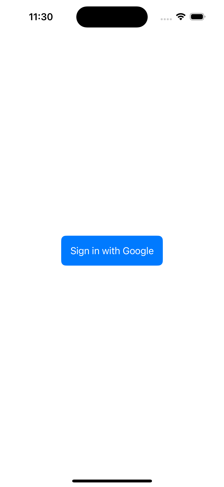
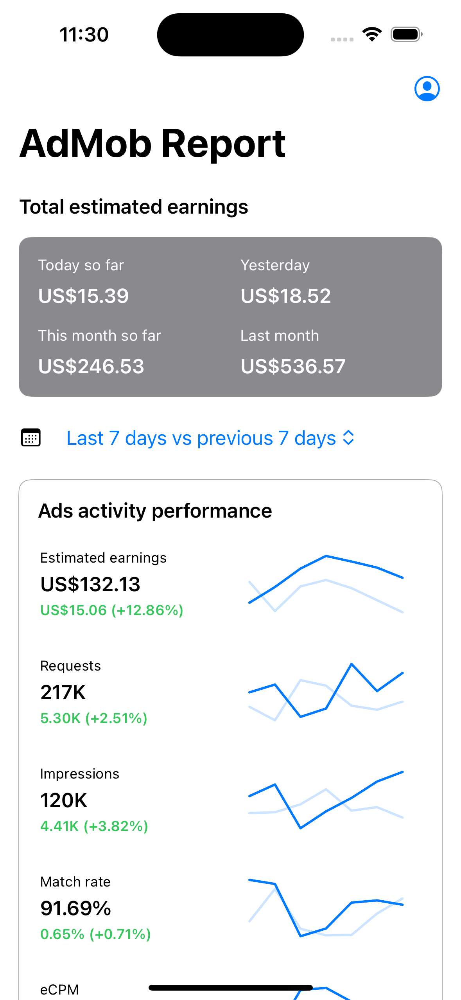
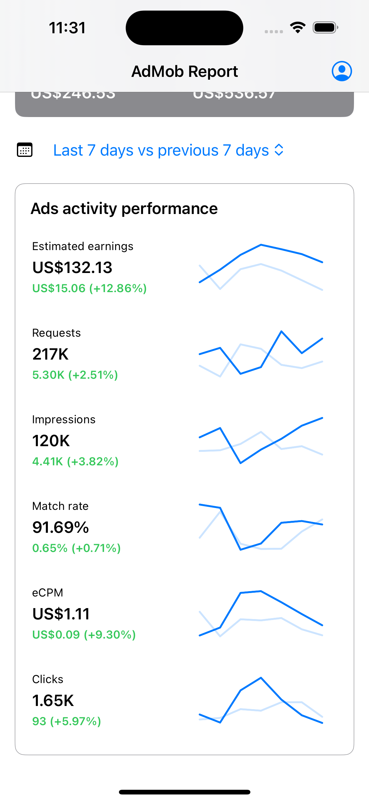

# AdRevenue-Watch

AdRevenueWatch is an iOS application that provides an intuitive interface for monitoring AdMob metrics. It is built using **SwiftUI** and **Swift Concurrency** to fetch and display AdMob network reports. The app follows **MVVM + Clean Architecture** to maintain a scalable and maintainable codebase.

## 🖼️ Screenshots

<p align="center">



</p>

## 💡 Features 

- **Google Sign-In:** Authenticate users via Google to access their AdMob metrics securely, supporting OAuth2 authentication.
- **Fetch AdMob Reports:** Fetch AdMob network reports using the Google AdMob API.
- **Dashboard Overview:** View key metrics like total earnings, requests, impressions, match rate, and eCPM in a visually appealing manner.
- **Detailed Reports:** Compare current metrics with previous periods, such as \"Last 7 days vs Previous 7 days.\"

## 🛠️ Requirements

- iOS 15.0+
- Xcode 15+
- Swift 5.8+

## 🏢 Clean Architecture

AdRevenueWatch is built using the principles of clean architecture to separate concerns and ensure testability. The project structure is divided into the following layers:

### Layers:

1. **Presentation**:
   - Contains UI components, ViewModels, and utilities for rendering the user interface.
   - Built using SwiftUI.
2. **Domain**:
   - Holds the core business logic and use cases.
   - Contains abstractions that define interactions between the app's layers.
3. **Repository**:
   - Manages data sources (e.g., network calls, local storage) and provides data to the domain layer.
   - Ensures that the domain layer remains agnostic of specific data sources.

## 📁 Folder Structure

- **App**: Entry point for the application. Contains `AdRevenueWatchApp.swift` and dependency setup.
- **Modules**:
  - **Domain**: Core business logic and use cases.
  - **Repository**: Data management and API integration.
- **Presentation**:
  - **Components**: Reusable UI components.
  - **Features**: Feature-specific views and ViewModels.
  - **Manager**: Manages shared resources such session.
  - **Models**: Models specific to the UI layer.
  - **Utils**: Utility files for shared helper functions.
- **Config**: Configuration files.
- **Supportings**: Additional assets and resources.
- **Tests**:
  - **Mocks**: Mock objects for unit testing.
  - **Test Cases**: Includes `AdRevenueWatchTests.swift` and `AppViewModelTests.swift`.

## 🔧 Setup Instructions

1. Clone the repository:

   ```bash
   git clone https://github.com/banghuazhao/AdRevenue-Watch.git
   ```

2. Open the project in Xcode:

   ```bash
   cd AdRevenueWatch
   open AdRevenueWatch.xcodeproj
   ```

3. Install dependencies.

4. Set up Google Sign-In credentials in `Config`.
- Create a Google Cloud project with access to the **Google AdMob API**.
- OAuth2 credentials set up in the Google Cloud Console.
- Create `Secret.xcconfig` file in `Config` folder and add your credentials
```
GIDClientID = Your_GIDClientID
GOOGLE_REDIRECT_URL_SCHEMES = Your_GOOGLE_REDIRECT_URL_SCHEMES
```

5. Build and run the project on a simulator or a physical device.

## 📊 Testing

The project includes unit tests to ensure the integrity of the core logic. The test cases are located in the `AdRevenueWatchTests` folder. Run the tests using the following steps:

1. Open the project in Xcode.
2. Press `Command + U` to run the tests.

---

## 🙏 Contributing

Contributions are welcome! If you have suggestions or improvements, feel free to open an issue or submit a pull request.

---

## 📄 License

This project is licensed under the MIT License. See the LICENSE file for details.
